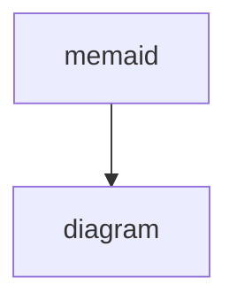

#ooux 

# Using Object Oriented UX in user research — it can be done!

Dani Nordin
Product Design Architect
https://medium.com/athenahealth-design/using-object-oriented-ux-in-user-research-it-can-be-done-f4c484972032

---

## Can the Object Map used to facilitate user research?

---

### A importância do conteúdo
O conteúdo é a interface do sistema que irá ajudar o usuário a entender o que precisa ser feito

---

[O UX Orientado a Objetos](https://bootcamp.uxdesign.cc/introducing-orca-the-third-diamond-in-your-ux-process-23a1babb0389) fornece uma maneira para designers e equipes alinharem a estrutura e o conteúdo antes de começarem a projetar telas.

---

Ao entender os **OBJETOS** com os quais as pessoas precisam interagir, os **ATRIBUTOS** que precisam existir dentro deles e as **CHAMADAS À AÇÃO** que eles oferecem, podemos ter conversas melhores com nossos desenvolvedores e nos preparar para experiências que podemos iterar e evoluir ao longo do tempo.

---

### Mapa de Objetos
O Mapa de Objetos descreve os objetos no sistema, juntamente com seus relacionamentos e atributos.

---

Embora isso possa ser valioso para equipes de produto e engenharia, durante um projeto recente, **nos perguntamos se também poderia ser usado para pesquisa de usuários**

---

---

---

