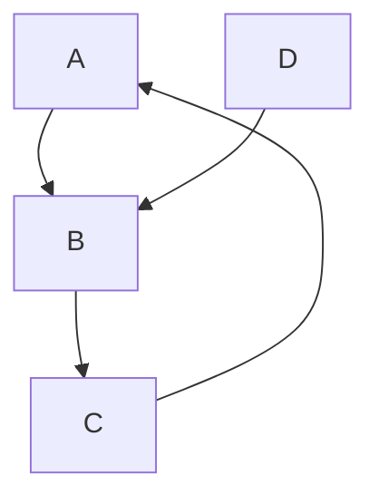

# Estudo sobre a linguagem UML e como ela pode ser usada no processo de Design

---

## O que é UML

A UML (Unified Modeling Language) em português Linguagem de Modelagem Unificada, é uma linguagem-padrão para a elaboração da estrutura de projetos de software. 

Ela poderá ser empregada para a visualização, a especificação, a construção e a documentação de artefatos que façam uso de sistemas complexos de software. 

a UML é uma linguagem que permite representar um sistema de forma padronizada, com intuito de facilitar a compreensão pré-implementação.

https://pt.wikipedia.org/wiki/UML

---

## A UML não é uma metodologia de desenvolvimento

o que significa que ela não diz para você o que fazer primeiro e em seguida ou como projetar seu sistema, mas ela lhe auxilia a visualizar seu desenho e a comunicação entre os objetos (e em certos casos a identificação dos processos).

---

## História

Os esforços para a criação da UML tiveram início em outubro de 1994, quando Rumbaugh se juntou a Booch na [Rational](https://pt.wikipedia.org/wiki/Rational_Software_Corporation "Rational Software Corporation"). Com o objetivo de unificar os métodos Booch e OMT, decorrido um ano de trabalho, foi lançado, em outubro de 1995, o esboço da versão 0.8 do _Unified Process_ - Processo Unificado (como era conhecido). Nesta mesma época, Jacobson se associou à Rational e o escopo do projeto da UML foi expandido para incorporar o método OOSE. Nasceu então, em junho de 1996, a versão 0.9 da UML.

Finalmente em 2000, a UML foi aprovada como padrão pelo OMG (Object Management Group), um consórcio internacional de empresas que define e ratifica padrões na área de Orientação a Objetos.

---

## Visão Geral

UML 2.2, conforme o [OMG](https://pt.wikipedia.org/wiki/Object_Management_Group "Object Management Group"), possui catorze tipos de diagramas, divididos em duas grandes categorias: Estruturais (7 diagramas) e Comportamentais (7 diagramas). 

Sete tipos de diagramas representam informações estruturais, e os outros sete representam tipos gerais de comportamento, incluindo quatro em uma sub-categoria que representam diferentes aspectos de interação. Estes diagramas podem ser visualizados de forma hierárquica, como apresentado no padrão de [diagrama de classes](https://pt.wikipedia.org/wiki/Diagrama_de_classes "Diagrama de classes") abaixo:

![[Pasted image 20220716131025.png]]

---

## Diagramas UML 2.5
- Diagramas Estruturais
- Diagramas de Classe
- Diagramas de Objetos
- Diagramas de Componentes
- Diagramas de Implementação
- Diagrama de Pacotes
- Diagrama de Estrutura Composta
- Diagrama de Perfil
- Diagrama Comportamental
- Diagrama de Caso de Uso
- Diagrama de Sequência
- Diagrama de Colaboração
- Diagrama de Transição de Estados
- Diagrama de Atividade

---

---
