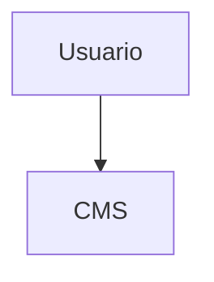
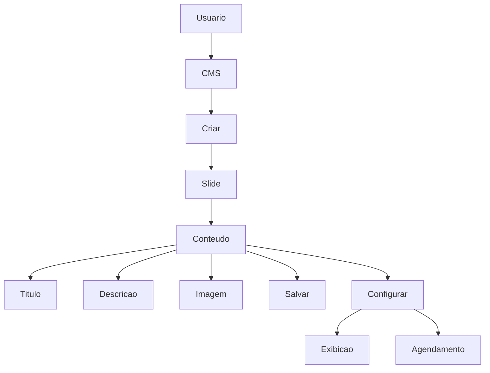

# Diagrama CMS

###### Fluxo do Usuário

```mermaid
graph TD;
	Usuario-->CMS
	CMS
	
```

###### CRUD CMS

```mermaid
graph TD;
	Usuario-->CMS
	CMS-->Criar
		Criar-->Slide
			Slide-->Conteudo
				Conteudo-->Titulo
				Conteudo-->Descricao
				Conteudo-->Imagem
				Conteudo-->Salvar
				Conteudo-->Configurar
				Configurar-->Exibicao
				Configurar-->Agendamento
```

